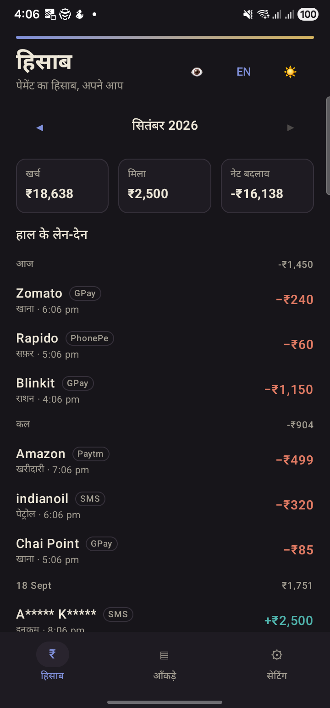
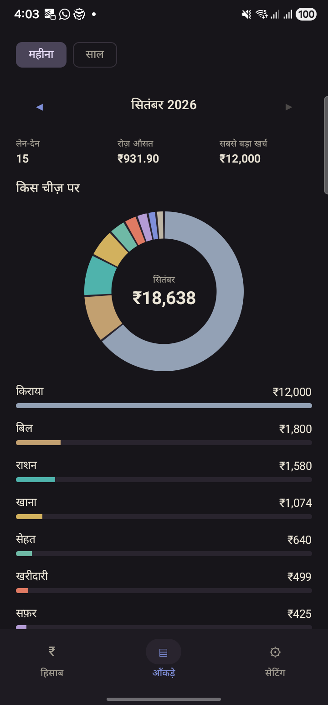
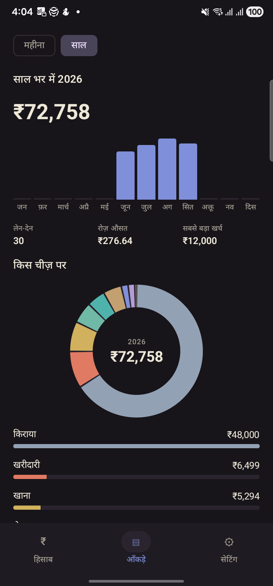
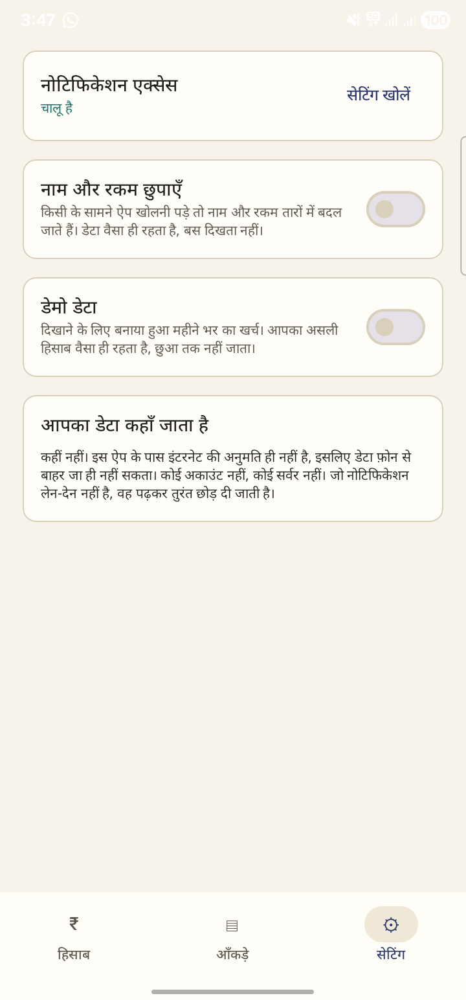

# Hisaab — हिसाब

**पेमेंट का हिसाब, अपने आप।**

An Android app that turns UPI payment notifications into a Hindi expense ledger. No manual
entry, no account, no login, and no server. The payment already produced a notification;
Hisaab reads it and does the accounting.

Built from scratch in one day at the Fable 5.1 Build Day, Bhopal, on 20 September 2026.
Track: Everyday.

## Screenshots

| Ledger | Stats, by month |
|---|---|
|  |  |

| Stats, by year | Settings |
|---|---|
|  |  |

Screenshots use the built-in demo data, not real transactions.

## What it does

- **Reads payment notifications.** A `NotificationListenerService` picks up notifications
  from GPay, PhonePe, Paytm, BHIM and bank apps as they arrive. Bank SMS sender IDs are
  used to label the source of a row.
- **Parses them.** The amount, the direction (money in or money out), the counterparty and
  a category are extracted on-device.
- **Hindi first.** The interface is Hindi, keeping the English financial words Indians
  actually say. Amounts are set in tabular figures so columns line up, with a running
  per-day total. An EN toggle switches the whole interface to English.
- **Stats.** A month or year scope, a category donut, per-category bars, and a month
  summary.
- **Private mode.** Masks every name and amount on screen, for opening the app in front of
  someone. The data is unchanged, it is only hidden.
- **Demo mode.** Fills the app with a month of synthetic spending so it can be shown
  without exposing real transactions. Real data is left untouched.

## Privacy

The app declares **no `uses-permission` entries at all**, including no `INTERNET`. Check
[`AndroidManifest.xml`](app/src/main/AndroidManifest.xml) yourself: transaction data
cannot leave the phone, because the app has no way to send it.

Notification access is the one capability it needs, and Android grants that through a
separate settings screen that you control. `RECEIVE_SMS` and `READ_SMS` are never
requested. Notifications that are not transactions are read and dropped immediately.

There is no account, no server, and no analytics. Everything lives in a local Room
database.

## Install

Download `app-debug.apk` from the [latest release](https://github.com/aloks1701/Hisaab-Android/releases/latest),
allow installs from unknown sources, and grant notification access on first run. Turn on
Demo Data in Settings to see the app populated without making a payment.

This is a debug build, not release-signed, so Android will warn about the installer.

## Build

```sh
./gradlew assembleDebug
```

Kotlin and Jetpack Compose, Room 2.8.5, Compose BOM 2026.09.00, minSdk 24, targetSdk 37.
No dependency injection framework and no network stack, because there is nothing to
inject and nothing to fetch.

## Layout

| File | Holds |
|---|---|
| `HisaabNotificationListener.kt` | The notification listener, the live capture path |
| `Parsing.kt` | Notification text to a transaction: amount, direction, counterparty, category |
| `Ledger.kt` | Room entities, DAO, database |
| `LedgerScreen.kt` | The ledger, grouped by day with per-day totals |
| `StatsScreen.kt` | Month and year scopes, category donut, bars |
| `SettingsScreen.kt` | Notification access, private mode, demo data |
| `Privacy.kt` | Masking |
| `MockData.kt` | The synthetic dataset behind demo mode |
| `Period.kt` | Month and year filtering |
| `Strings.kt` | Hindi and English strings |
| `Theme.kt` | Colors, typography, light and dark |
